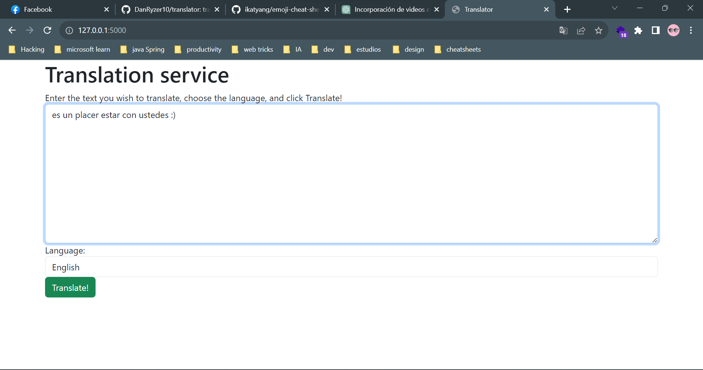

# pynslator 👻

aplicación para traducir archivos de texto a diferentes idiomas

*******************

### pre-requisitos
* python > 3.8
* pip
* venv
* cuenta de microsoft azure 

### configuración
* crear archivo .env en la raíz del proyecto
* agregar las siguientes variables de entorno
````python
# .env
KEY = "your-azure-key"
ENDPOINT = "your-azure-endpoint"
LOCATION = "your-azure-location"

# recuerdaque todos estos datos apareceran en el portal de azure
````
en azure, crear un recurso de tipo "Translator Text" y copiar los datos en el archivo .env
### instalación
````python
python -m venv venv # crear entorno virtual
source venv/bin/activate # activar entorno virtual en linux
venv\Scripts\activate # activar entorno virtual en windows
pip install -r requirements.txt # instalar dependencias

python -m flask --app app.py run # iniciar servidor
````

